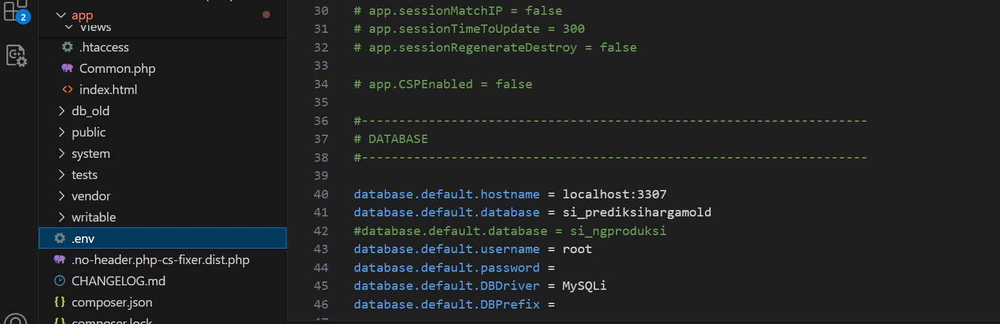
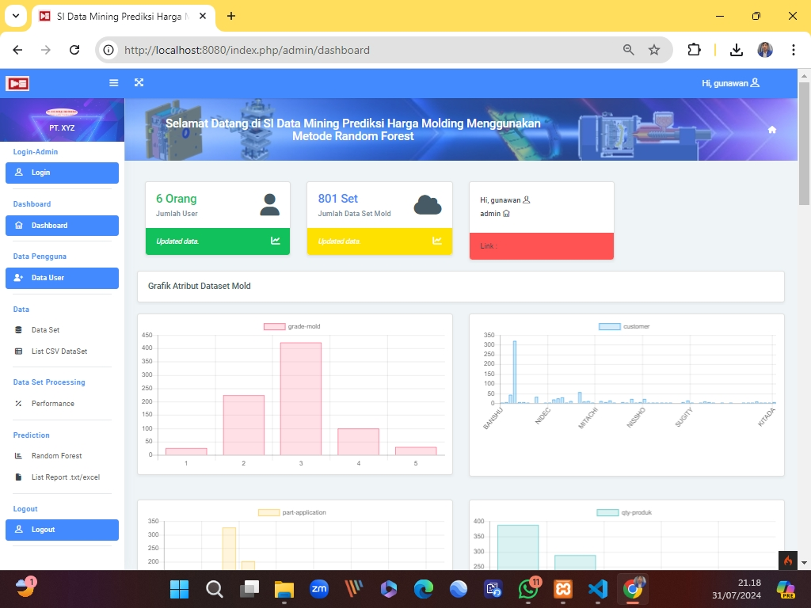
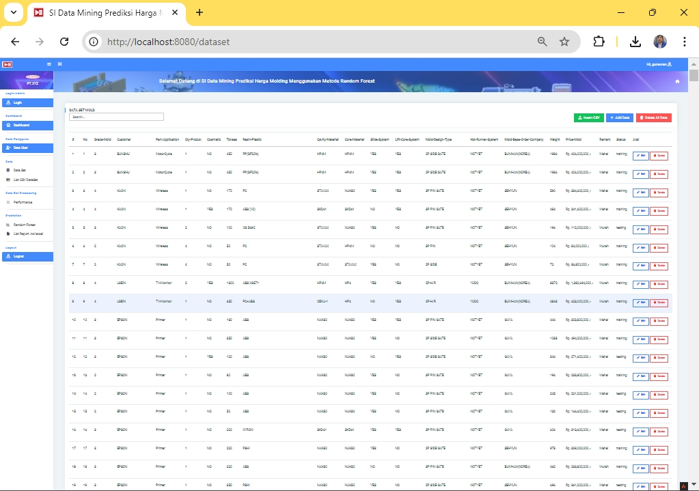
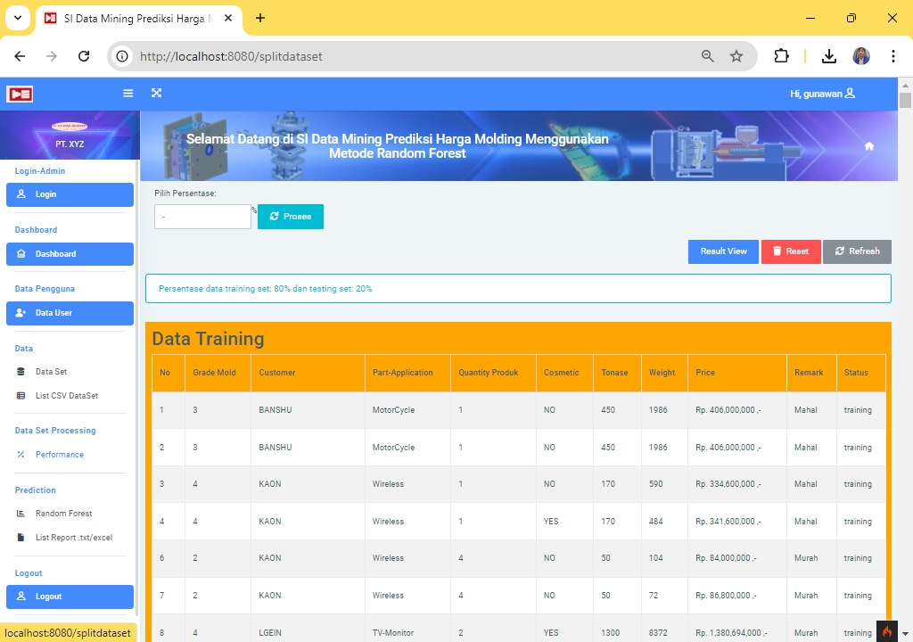
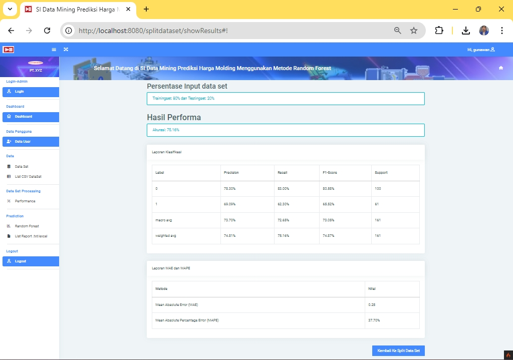
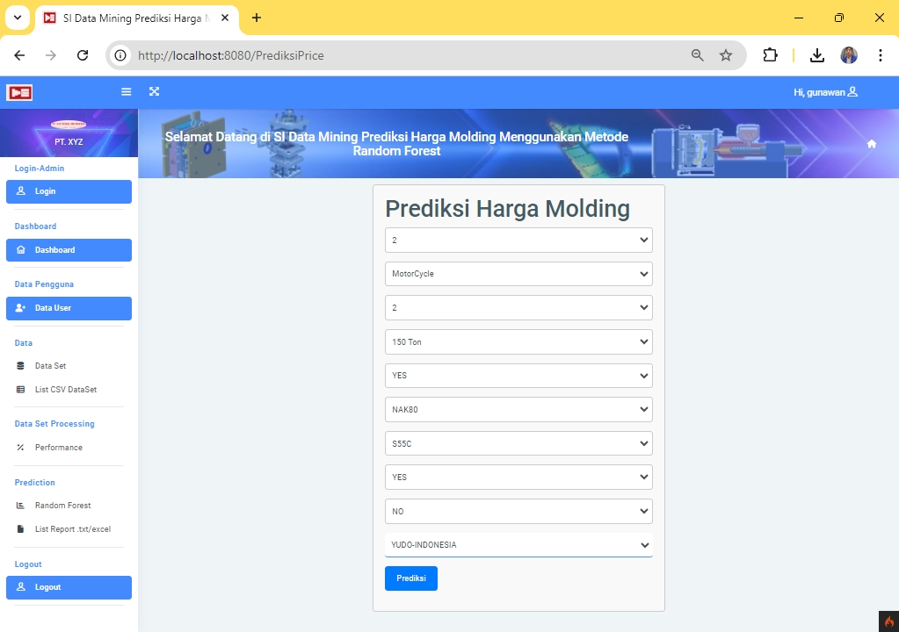
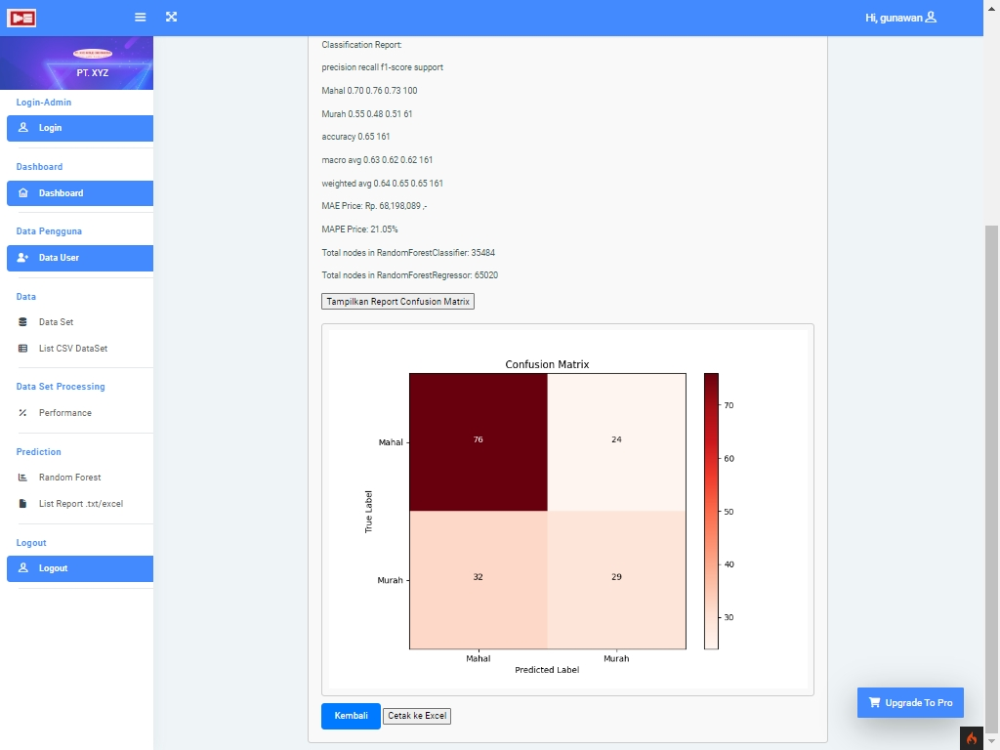
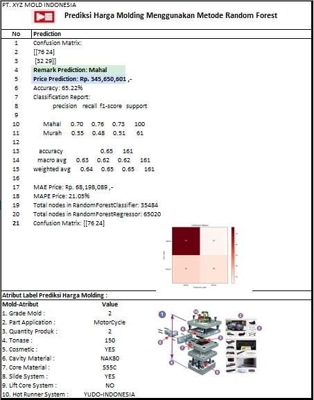

**PREDIKSI HARGA MOLDING INJECTION DENGAN DATA MINING MENGGUNAKAN METODE RANDOM FOREST BERBASIS WEB CODEIGNITER 4**

**``Penelitian Skripsi``**
 
• membuat code program PHP menggunakan Framework Codeigniter 4

  
  **``Membuat Database``**
  
  
   **`` Konfigurasi koneksi database & Membuat Program php``**
  
  
  
   **``XAMPP Control Panel ``**
  
   **``Menjalankan CLI (Command Line Interface)``**
  
  Perintah yang dapat dijalankan untuk memanggil CLI Codeigniter adalah: 
  ``php spark`` dan 
  
  ``php spark serve``
  
   Selanjutnya buka browser kembali, dengan mengakses url : <http://localhost:8080/home>
   
 **``Dasboard ``**   

 **``Dataset ``** 
 
  
 **``Performance ``** 
 
 
 **``Report Performance ``** 
 
 
  **``Form Prediction RF ``** 
 
 
   **``Report Prediction RF ``** 
 
 
 **``ConfusionPrediction RF ``** 
 
 
  **``excel Report Prediction RF ``** 
  
 
 

  
  Cukup Sekian Penjelasan Dari saya
  
  **TERIMAKASIH**

